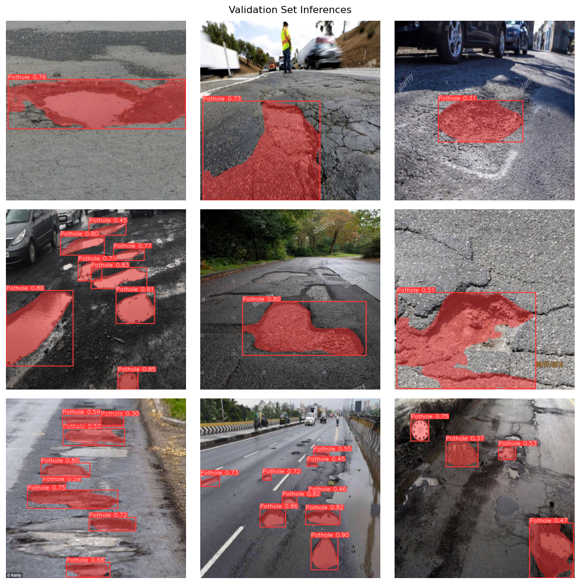

# pothole-image-segmentation
本项目提出了一种基于YOLOv8的路面坑洞检测任务方法，实现了对坑洞的自动化识别和定位。

### :hear_no_evil:开发环境
windows 11  
python 3.11  
Ultralytics  
以及各种库（详见代码）  

### :see_no_evil:数据集
来源于kaggle网站的[Pothole Image Segmentation Dataset](https://www.kaggle.com/datasets/farzadnekouei/pothole-image-segmentation-dataset)  
请前往网站自行下载

###:speak_no_evil:对数据集的预处理有
、高斯滤波
、像素归一化

### :hear_no_evil:运行代码前的一些准备工作
#### :smirk_cat:设置路径数据
` dataDir = '/content/Pothole_Segmentation_YOLOv8/' `  
`/content/Pothole_Segmentation_YOLOv8/`表示存储图像分割任务的数据集的目录。  
#### :smirk_cat:加载性能最佳的模型
在模型训练完成后，需要加载性能最佳的模型  
` bestModelpath = '/content/runs/segment/train/weights/best.pt' `  
`bestModelpath`该变量包含训练期间获得的最佳模型的文件路径。  
#### :smirk_cat:加载视频做推理
` videoPath = '/content/Pothole_Segmentation_YOLOv8/sample_video.mp4' `  
`'/content/Pothole_Segmentation_YOLOv8/sample_video.mp4'`表示存储推理视频的目录。  
### :heart_on_fire:运行代码:heart_on_fire:
`python pothole-image-segmentation.py`  
### :open_mouth:功能预览

